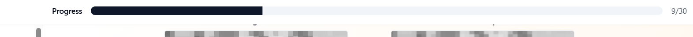
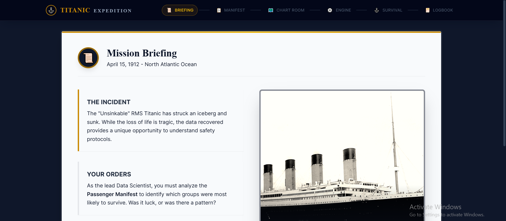
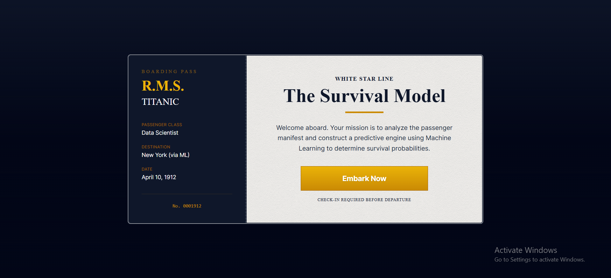
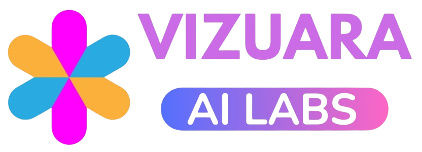
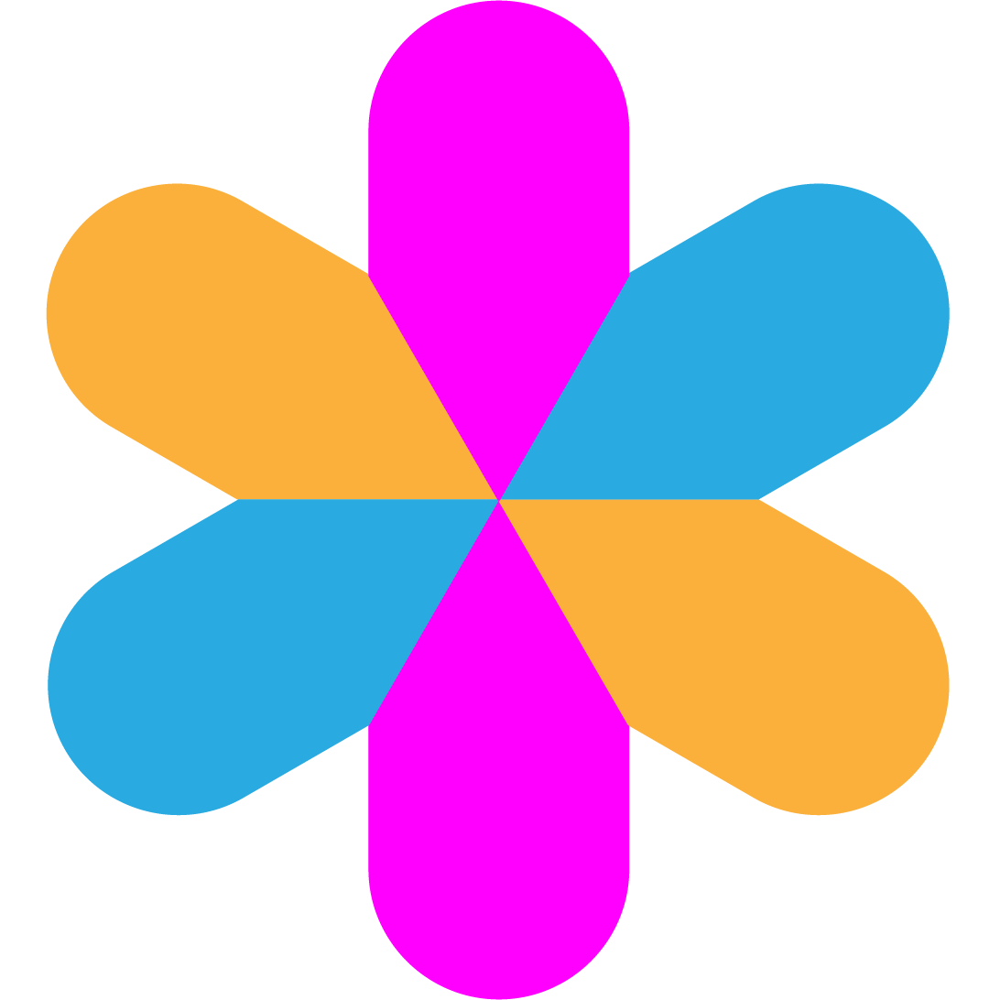

# School Projects – Change Specifications Repository

This repository contains **detailed change specifications** for all school-level projects (Classes 5–10).

Each project has its **own folder** with:
- A clear description of what needs to be changed
- Screenshots or reference images
- Notes, constraints, and expectations

This repository is the **single source of truth** for development changes.

---

## Purpose of This Repository

These projects are used by **school students** to learn concepts in:
- Machine Learning
- Artificial Intelligence

The goal of the changes described here is to:
- Improve clarity and usability for students
- Make concepts easier to understand
- Keep projects age-appropriate and engaging
- Ensure technical correctness without overengineering

## Some instructions to follow in all projects
- Add a progress bar like this.

- The project should be divided in pages like this with similar padding on either side.

- The landing page UI should be like this, with a centred card.

- The landing page should show the company logo & favicon should be used as well.

- The landing page bg should either be very dark (like the one used in the Titanic project) or very light, so that it can go with our website well.
