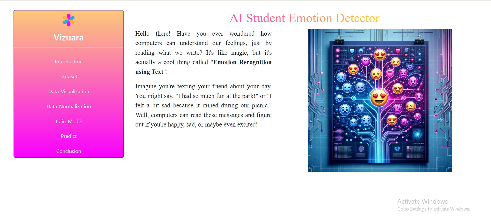
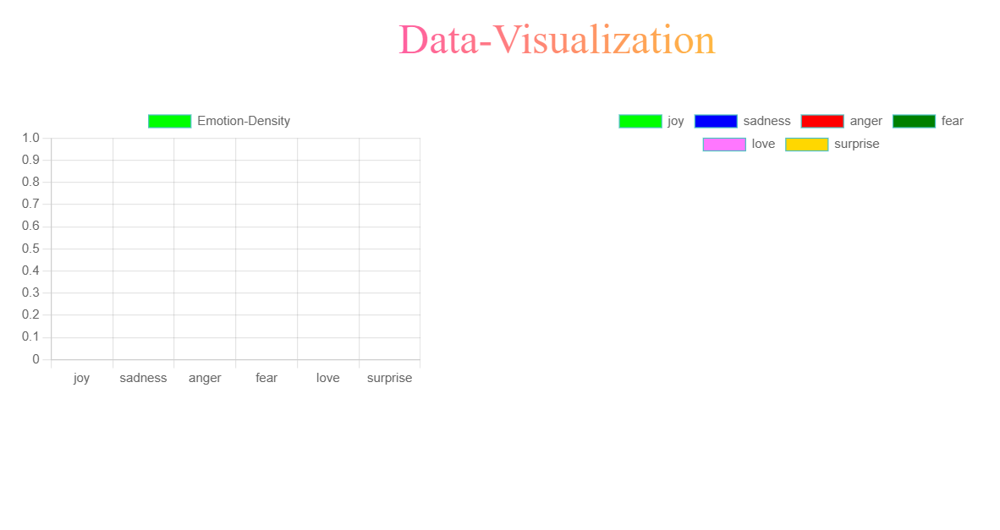
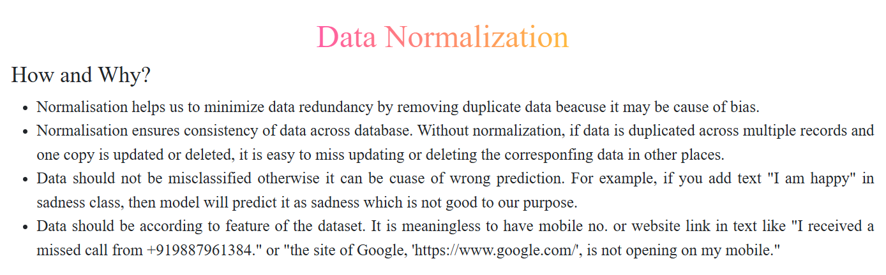

## Issues

### 1. Poor UI quality and visual structure

The overall user interface lacks clarity and polish. Elements feel loosely arranged, with no strong visual hierarchy guiding the learner’s attention. For a school-facing project, this makes the experience feel confusing and discouraging rather than inviting and exploratory.

---

### 2. Interface looks overly AI-generated

The current design appears heavily auto-generated, with generic layouts, repetitive patterns, and visual choices that feel synthetic and incoherent. This reduces trust and relatability for students, who may perceive the project as artificial and not well thought-out rather than thoughtfully designed for learning.

---

### 3. Improper and inconsistent use of gradients

Gradients are applied in a way that feels arbitrary and distracting. Instead of helping separate sections or emphasize important content, they compete for attention and weaken the visual hierarchy. In some places, gradients make text harder to read and do not serve any instructional purpose.

---

### 4. Inappropriate font choice

The selected font does not align with the technological or educational nature of the project. It affects readability and does not feel suitable for a classroom or learning environment. For school students, font clarity and familiarity are especially important to reduce cognitive load.

---

### 5. Missing conceptual discussion of sentiment analysis

The project jumps directly into emotion detection without first explaining what sentiment analysis is, why it is useful, or how it differs from emotion detection. This creates a conceptual gap for students, especially beginners, who need foundational context before interacting with advanced ideas.

---

### 6. Poor data visualization

The current visualizations are unclear and do not effectively communicate insights from the data.

---

### 7. Random and unnecessary data normalization section

---

A data normalization section is introduced without sufficient context or necessity. It feels disconnected from the rest of the project flow and breaks conceptual consistency. For the intended audience, this section adds confusion rather than learning value and does not align with the overall narrative of the project.

## Design & Learning Flow

This project is designed as a **guided learning journey** that gradually introduces students to emotions, language, and sentiment analysis in a way that feels natural, relatable, and age-appropriate. Each section builds conceptually on the previous one, ensuring students are never overwhelmed or confused.

---

### 1. Understanding Emotions (Human Perspective)

The project should begin by introducing students to the idea of **emotions as humans experience them naturally**. Humans understand emotions intuitively through facial expressions, situations, tone of voice, and personal experiences. This understanding happens automatically and does not require conscious effort.

At the same time, it should be clearly explained that **computers do not experience emotions**. They do not feel happiness, sadness, or anger the way humans do.

**Exercises:**
- Match everyday situations to emotions (e.g., “losing a favorite toy”, “winning a game”)
- Identify emotions from short, simple stories or scenarios

The goal of this section is to ground students in what emotions mean *to humans* before introducing computers at all.

---

### 2. From Faces to Words: Emotions in Text

In this section, the focus shifts from facial or situational emotions to **text-based emotions**, which is the foundation of sentiment analysis.

Students should learn that:
- People express emotions not only through faces, but also through **words**
- Punctuation, word choice, and tone all carry emotional meaning
- Computers cannot see faces, but they **can read text**

This transition should feel logical: humans show emotions in many ways, but when computers are involved, **text becomes the primary source**.

**Exercises:**
- Compare sentences and decide which sounds happier, angrier, or sadder
- Discuss how small word changes affect emotional tone

---

### 3. What Is Sentiment Analysis?

This section introduces the term **“Sentiment Analysis”** in a calm and non-intimidating way.

Students should understand that:
- Sentiment analysis is about **guessing emotions from text**
- It is not magic and not mind-reading
- It works by recognizing patterns in language

The emphasis should be on **demystification**. The term may sound complex, but the idea behind it is simple.

**Exercises:**
- Identify sentiment (positive, negative, neutral) from short reviews or comments
- Explain why a sentence feels positive or negative

---

### 4. How Do Computers “Understand” Emotions?

This section gently introduces AI concepts without technical overload.

Key ideas to communicate:
- Computers do not understand meaning like humans do
- They do not feel emotions
- They look for **patterns in words**
- AI learns from examples, not feelings

Explain that if an AI sees many sentences labeled “happy”, it slowly learns what *happy text tends to look like*. This learning happens through repetition and data, not understanding.

**Exercise (example):**
- Show multiple sentences labeled with emotions and ask students what patterns they notice
- Predict what emotion a new sentence might be labeled as and explain why

---

### 5. Emotion Categories: Our AI’s World

Students should be introduced to the idea that **computers need fixed categories**.

Explain that:
- Humans can feel many emotions at once
- Computers must choose **one label**
- AI simplifies the emotional world so it can work with it

This helps students understand both the power and limitation of AI systems.

**Exercises:**
- Choose the best emotion label for a sentence
- Discuss cases where more than one emotion could apply

---

### 6. Mistakes, Bias, and “AI Is Not Always Right”

This section is critical for building healthy AI understanding.

Students should learn that:
- Short or unclear sentences are hard for AI
- Sarcasm is especially confusing
- Different people express emotions differently
- AI mistakes do not mean the student is wrong

This reinforces trust without blind belief.

**Exercises:**
- Decide whether a sentence would be easy or hard for AI to understand
- Explain *why* certain sentences are challenging

---

### 7. Real-Life Uses of Sentiment Analysis

Introduce where sentiment analysis is used in the real world, such as:
- Product reviews
- Movie or app ratings
- Social media comments
- Customer feedback

These examples should feel familiar and relevant to students.

**Exercises:**
- Guess the sentiment of real-world style comments
- Discuss how companies might use this information

---

### 8. Training an AI: Becoming the Teacher

This is the hands-on core of the project.

Students should:
- Train an AI using a **pre-existing dataset**
- Decide how much data to use
- Optionally add their own data through manual input or file upload

Key concepts to explain clearly:
- Training means **showing examples to the AI**
- More examples usually lead to better predictions
- Quality of data matters more than quantity
- Bad or confusing data leads to bad predictions

Students should also be able to:
- Run inference on new sentences
- See how the AI predicts emotions
- Compare predictions before and after training

---

### 9. Conclusion and Reflection

The project should conclude by reinforcing key takeaways:
- AI does not feel emotions
- It works by finding patterns
- It can make mistakes
- Humans are responsible for how AI is trained and used

Students should leave with:
- A clearer understanding of sentiment analysis
- Confidence in interacting with AI systems
- Awareness of AI’s limitations

This conclusion should feel reflective and empowering, not technical or overwhelming.

---

## Goals

- Establish a clean, simple, and consistent design language suitable for school students  
- Ensure the interface feels intentionally designed rather than auto-generated  
- Use gradients sparingly, and only when they clearly improve readability or understanding  
- Select a font that is readable, modern, and appropriate for an educational technology project  
- Introduce sentiment analysis conceptually before moving into emotion detection  
- Improve data visualizations so they clearly explain what the data shows and why it matters  
- Remove or rethink sections that do not directly contribute to learning clarity or project coherence  
- Include a progress bar that indicates how much learning has been done
