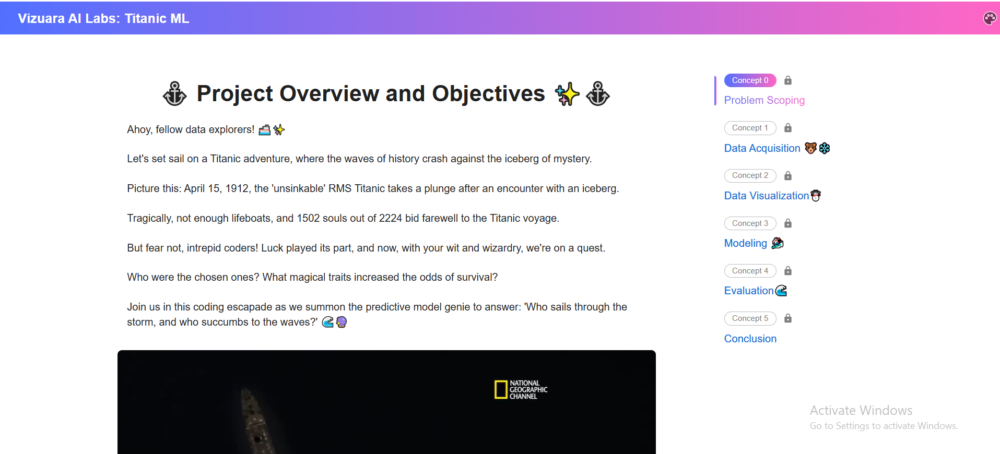
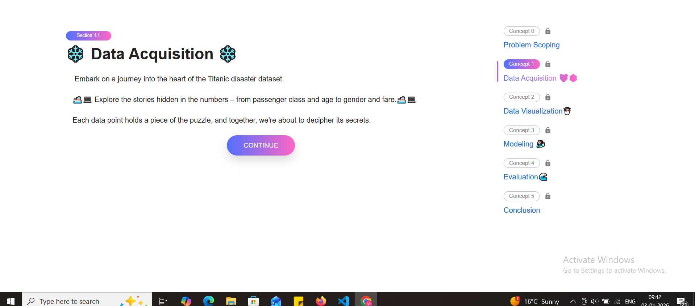
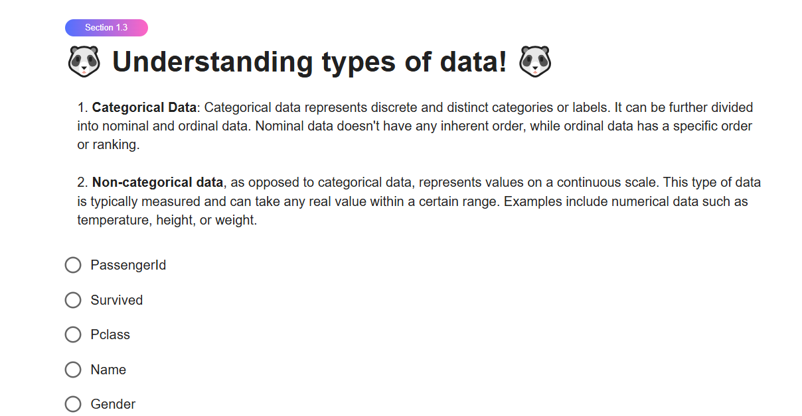
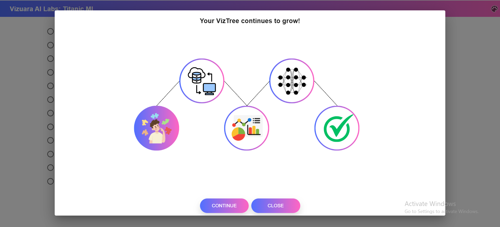
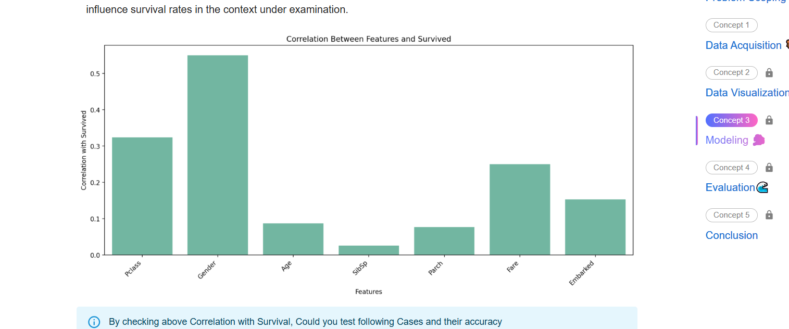
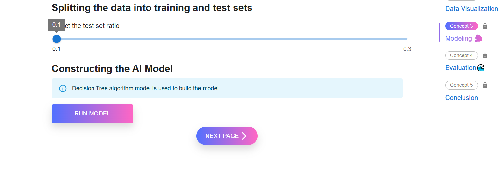
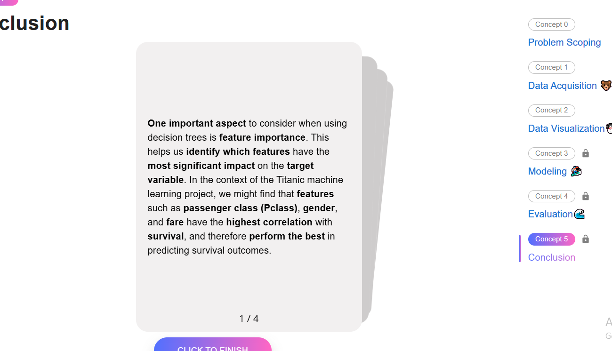

# Project Name: Titanic Survivor Prediction

## Issues

### 1. Poorly Designed Landing Page

The landing page should be separate from the main module and feature a compelling visual that reflects the theme, context, and story of the Titanic.

---

### 2. Unnecessary Sidebar and Overuse of Emojis

The module is intended for high school students, so it should strike a balance between being engaging and maintaining a slightly more serious, adventurous tone. The excessive use of emojis and the sidebar detract from this balance.

---

### 3. Excessive Text with Poor Formatting

While explanatory text is necessary, the module contains too much unstructured text, making it overwhelming and harder to read.

---

### 4. Overuse of Gradients

The gradients feel excessive and give the interface an overly “AI-generated” appearance.

---

### 5. Confusing Progression Flow

The sidebar provides little value since users cannot navigate back to previous steps. Additionally, the repeated use of `Continue` buttons creates a confusing progression flow due to how components are revealed.

---

### 6. Inconsistent and Poor Quiz UI

The quiz interface results in a poor user experience and lacks consistency across different sections of the module.

---

### 7. Intrusive Progress Tracker

While not problematic on its own, the progress tracker appears every time a sidebar item is completed, adding unnecessary friction to an already cluttered experience.

---

### 8. Poor Visualizations

Visualizations are the core of an ML project. They should be visually appealing while clearly and effectively conveying meaningful information.

---

### 9. Train-Test Split Ratio Bug

There is a bug in the train-test split logic. The ratio is applied opposite to what the UI suggests, leading to incorrect assumptions.

---

### 10. Out-of-Place UI Components

The card design does not align with the overall visual language of the module and feels inconsistent with the rest of the interface.

---

Here’s a **Goals** section crafted in the same style and level of clarity, tailored specifically to the *Titanic Survivor Prediction* project and grounded in the issues you identified:

---

## Goals

* Create a visually engaging yet age-appropriate learning experience for high school students, balancing seriousness with a sense of exploration and discovery
* Design a dedicated landing page that sets narrative context and draws students into the Titanic story before introducing machine learning concepts
* Establish a clean, consistent design system that feels thoughtfully crafted rather than auto-generated
* Reduce visual noise by limiting unnecessary UI elements, emojis, gradients, and decorative components
* Simplify navigation and progression so students clearly understand where they are, what they’ve completed, and what comes next
* Replace the current sidebar-based progression with a clearer, more intuitive learning flow that allows logical backtracking when appropriate
* Standardize quiz and exercise UI across the module to ensure a consistent and predictable user experience
* Ensure students cannot proceed to the next section without completing all required exercises and quiz questions in the current section
* Fix logical inconsistencies, such as the train-test split ratio bug, so UI behavior matches student expectations and learning intent
* Redesign data visualizations to be visually appealing, easy to interpret, and strongly connected to the ML concepts being taught
* Use visualizations as teaching tools, not just outputs, clearly explaining *what* is shown and *why* it matters
* Remove or redesign UI components that feel out of place or do not directly contribute to learning clarity
* Introduce progress tracking in a subtle, non-intrusive way that motivates students without disrupting flow
* Ensure the overall experience reinforces core ML ideas such as data, features, training, testing, and prediction through interaction rather than excessive text
* **You are encouraged to experiment with UI, UX, structure, and content as long as the primary objective of helping students understand machine learning concepts through the Titanic dataset is achieved**
